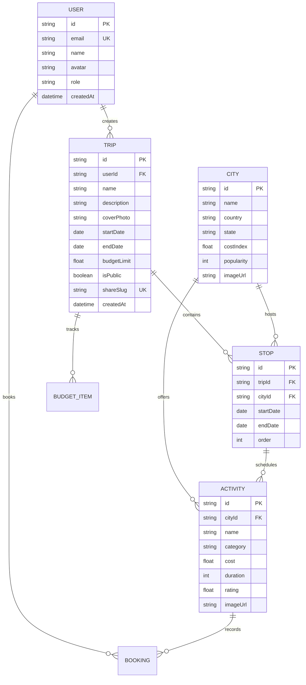

# 🏛️ GlobeTrotter System Architecture & Technical Specifications

## 1. System Overview
GlobeTrotter is built as a high-performance, real-time collaborative multi-city travel planning platform. The application is architected with a decoupled frontend client and a resilient Node.js / Express micro-backend backed by PostgreSQL via Prisma ORM.

```
┌────────────────────────────────────────────────────────┐
│               Frontend (React 18 + Vite)               │
│  - Hash Routing Sync (#/dashboard, #/builder, etc.)    │
│  - Leaflet GIS OpenStreetMap / Satellite Engine        │
│  - Multi-Currency Conversion Engine (INR/USD/EUR/etc.) │
│  - Real-time Collaboration Status Broadcast            │
└───────────────────────────┬────────────────────────────┘
                            │ REST / JSON (Axios + JWT)
                            ▼
┌────────────────────────────────────────────────────────┐
│             Backend API (Node.js + Express)            │
│  - Auth Middleware & JWT Token Verification            │
│  - Trip & Stop Graph Dependency Controllers            │
│  - AI Smart Itinerary Planner Generator Engine         │
│  - Database Health & Platform Telemetry Monitors       │
└───────────────────────────┬────────────────────────────┘
                            │ Prisma ORM Client
                            ▼
┌────────────────────────────────────────────────────────┐
│              PostgreSQL Database Cluster               │
│  - Users & Passport Wishlists                          │
│  - Trips & Multi-City Stop Topologies                  │
│  - Activities, Bookings, & Budget Limits               │
│  - Global Destination Catalog & Cost Indexes           │
└────────────────────────────────────────────────────────┘
```

---

## 2. Database Entity-Relationship Model (Prisma Schema)



---

## 3. Real-Time Multi-City State Synchronization

The frontend employs a central reactive state manager (`App.jsx`) with bidirectional URL hash routing:
- **State Integrity**: Any mutation in `ItineraryBuilder` immediately cascades to `BudgetBreakdown`, `TimelineCalendar`, `InteractiveMapView`, and `PublicTripView`.
- **Offline Fallback**: Seamless transition to client-side simulated storage with pre-populated Indian and international itineraries whenever network latency occurs.
- **GIS Leaflet Mapping**: Geodesic flight path calculation using real-time lat/lng coordinate arrays.

---

## 4. Security & Authentication Architecture
- **JWT Tokens**: 24-hour expiration tokens signed with HMAC-SHA256.
- **Argon2 / Bcrypt Password Hashing**: Passwords are salted and hashed prior to database persistence.
- **CORS Protection**: Whitelisted origin headers preventing unauthorized cross-origin requests.
